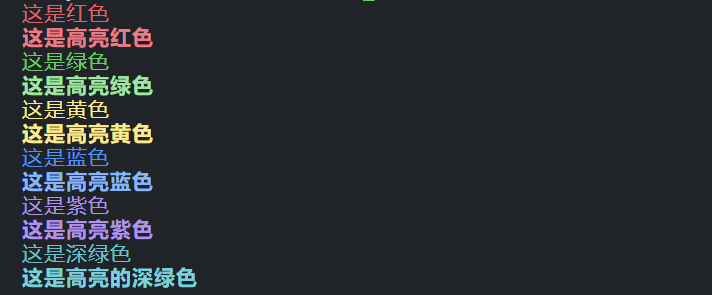
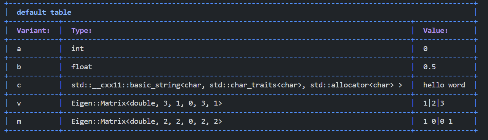
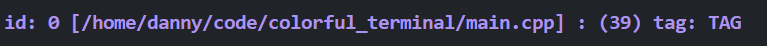

# Colorful Terminal (CTL)

一个轻量级的在终端输出彩色信息的代码库。

## 1 安装

`CTL` 基于ANSI语法实现在终端进行彩色字体的输出不需要依赖于任何其他的库。并且`CTL`只有一个头文件，在加入到你的工程里时，最简单的方法就是把它拖入到你的工程里。

你有两种方式使用，1）直接拖入到你的工程目录下；2）运行`install.sh`脚本文件会帮助你把头文件安装到头文件目录

```bash
git clone https://github.com/mengkai98/colorful_terminal.git
cd colorful_terminal
chmod +x install.sh
sudo ./install.sh
```

只需要在你的代码里包含这个头文件即可

```
#include <colorful_terminal/colorful_terminal.hpp>
```

# 2 基础用法

`CTL`中提供了几个预设方便进行输出

```c++
#include "colorful_terminal.hpp"
int main(int argc, char const *argv[])
{
    ctl::r_out()<<"这是红色"<<ctl::endl;
    ctl::hr_out()<<"这是高亮红色"<<ctl::endl;

    ctl::g_out()<<"这是绿色"<<ctl::endl;
    ctl::hg_out()<<"这是高亮绿色"<<ctl::endl;
    
    ctl::y_out()<<"这是黄色"<<ctl::endl;
    ctl::hy_out()<<"这是高亮黄色"<<ctl::endl;

    ctl::bl_out()<<"这是蓝色"<<ctl::endl;
    ctl::hbl_out()<<"这是高亮蓝色"<<ctl::endl;

    ctl::p_out()<<"这是紫色"<<ctl::endl;
    ctl::hp_out()<<"这是高亮紫色"<<ctl::endl;

    ctl::dg_out()<<"这是深绿色"<<ctl::endl;
    ctl::hdg_out()<<"这是高亮的深绿色"<<ctl::endl;
    return 0;
}
```

结果如下图所示：



<font color="red">注意，在使用`ctl`输出后，务必通过`ctl::endl`进行结尾，这样会清除掉前面设定的格式</font>

## 3 参数表

`CTL`自带有制表功能，只需要做一些简单的操作，就可以将参数表输出。使用宏`CTL_TABLE_ADD_VAR`将变量加入到table里。使用`make_table_and_out`将参数表打印到终端上。

```c++
int a = 0;
float b = 0.5;
std::string c = "hello word";
Eigen::Vector3d v{1,2,3};
Eigen::Matrix2d m;
m.setIdentity();
ctl::table_out *to = new ctl::table_out();
CTL_TABLE_ADD_VAR(to,a);
CTL_TABLE_ADD_VAR(to,b);
CTL_TABLE_ADD_VAR(to,c);
CTL_TABLE_ADD_VAR(to,v);
CTL_TABLE_ADD_VAR(to,m);
to->make_table_and_out();
```

在终端里，输出为下：



 当然我们可以对这个表做一些定制化的调整：

```c++
struct color_table_scheme{
    enum COLOR front_color =CRUNUSED;
    enum COLOR back_color = CRUNUSED;
    enum CTRL ctl = CLUNUSED;
};

color_table_scheme line_color;//线框颜色
color_table_scheme title_color;//表标题颜色
color_table_scheme head_color;//表头的颜色
color_table_scheme context_color;//字体颜色
int padding ;
std::string table_name;//表的名字
```

table有以上的一些属性，通过调整这些属性得到一个你自己喜欢的表格

## 4 设置测试点

有些时候我们需要debug一些消息时，或者要判断某一个地方会不会执行到，往往只需要输出一些提示性信息即可，这个时候可以使用`CTL_AUTO_TP`,`TP`是`test point`的缩写：

```C++
CTL_AUTOTP(TAG);
```

`TAG`可以是int、float、string等类型的数据。

输出如下：`[]`中的是这行代码所在的文件名，`()`里是行号


## 5 输出自定义数据，需要为你的数据结构重载“<<”
以std::vector为例
```C++
template<typename T>
friend ostream &operator>>( ostream &output, vector<T> &v )
{ 
    for(T&&a:v){
        output<<a;
    }
    output<<endl;
    return output;            
}
```
可以专门用一个头文件来存储所有输出运算符的重定义，以方便管理。
